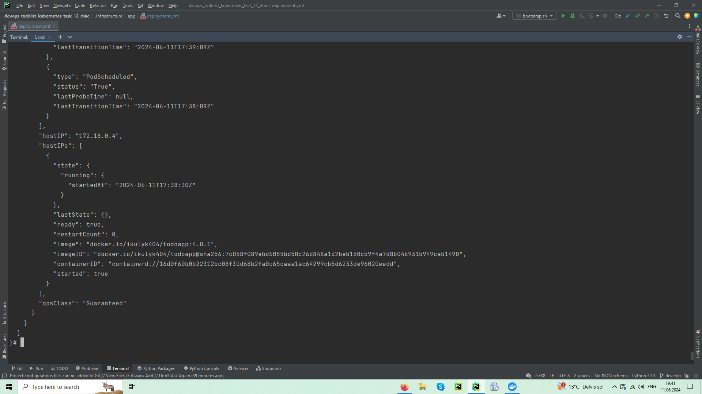

# Django ToDo list

## Validation changes
1. Run `bootstrap.sh`
2. Use `kubectl get pods -n todoapp`
3. Use `kubectl exec POD-NAME -it -n todoapp -- sh`, where POD-NAME is a name of your pod (NAME column). 
The command should look like `kubectl exec todoapp-9f575cc76-7vplb -it -n todoapp -- sh`
4. Use `SERVICEACCOUNT=/var/run/secrets/kubernetes.io/serviceaccount
APISERVER=https://kubernetes.default.svc
TOKEN=$(cat ${SERVICEACCOUNT}/token)
CACERT=${SERVICEACCOUNT}/ca.crt
curl --cacert ${CACERT} --header "Authorization: Bearer ${TOKEN}" -X GET ${APISERVER}/api/v1/namespaces/todoapp/pods` to get a response

